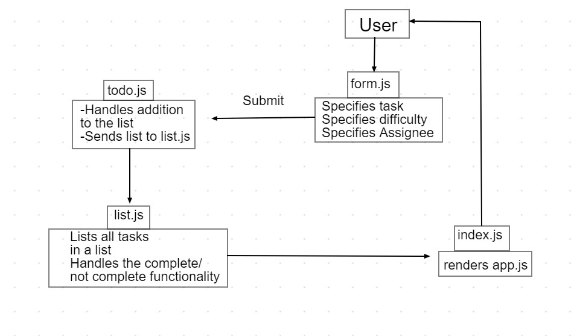

# LAB - 31

## Todo 

### Author: Ammar Badwan

### Links and Resources

- [Pull Request](https://github.com/ammarBadwan-401-advanced-javascript/todo/pull/2)

### How to initialize the application

* `npm run start`

### Modules

1. `todo.js`
2. `list.js`
3. `form.js`
4. `useAjax.js`
5. `useForm.js`

### UML

